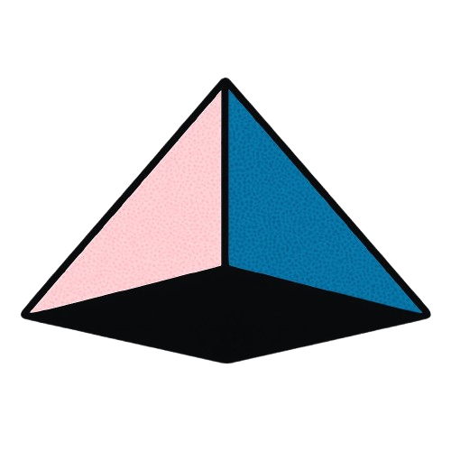

  

<h1 align="center">Superagent</h1>

  <strong>Open-source tools for making AI apps safe.</strong>

  <a href="https://superagent.sh">Website</a> ·
  <a href="https://docs.superagent.sh">Docs</a> ·
  <a href="https://discord.gg/spZ7MnqFT4">Discord</a> ·
  <a href="https://huggingface.co/superagent-ai">HuggingFace</a>

  

---

We build tools to make AI agents safer. Block prompt injections, redact sensitive data, and sandbox coding agents.

## Tools

| Tool | Description | |
|------|-------------|---|
| [**Superagent SDK**](https://github.com/superagent-ai/superagent) | Detect and block prompt injections, redact PII and secrets, scan repos for threats |  |
| [**Brin**](https://github.com/superagent-ai/brin) | Credit score for context |  |
| [**VibeKit**](https://github.com/superagent-ai/vibekit) | Run coding agents in isolated sandboxes with data redaction and observability |  |
| [**Grok CLI**](https://github.com/superagent-ai/grok-cli) | AI agent that brings Grok directly into your terminal |  |
| [**ReAG**](https://github.com/superagent-ai/reag) | Reasoning Augmented Generation. Query documents with full context, not chunked embeddings |  |

## Models

We publish open-weight guardrail models on [HuggingFace](https://huggingface.co/superagent-ai). These models detect prompt injections and unsafe inputs at runtime. Run them on your infrastructure (CPU or GPU) with 50-100ms latency. No API calls, no data leaving your environment.

## Resources

- [Documentation](https://docs.superagent.sh)
- [Blog](https://superagent.sh/blog)
- [Discord Community](https://discord.gg/spZ7MnqFT4)
- [X](https://x.com/superagent_ai)

## Commercial

We offer [red team testing](https://superagent.sh) for AI agents. We attack your production system to surface vulnerabilities, then give you the evidence to prove safety to your customers.
